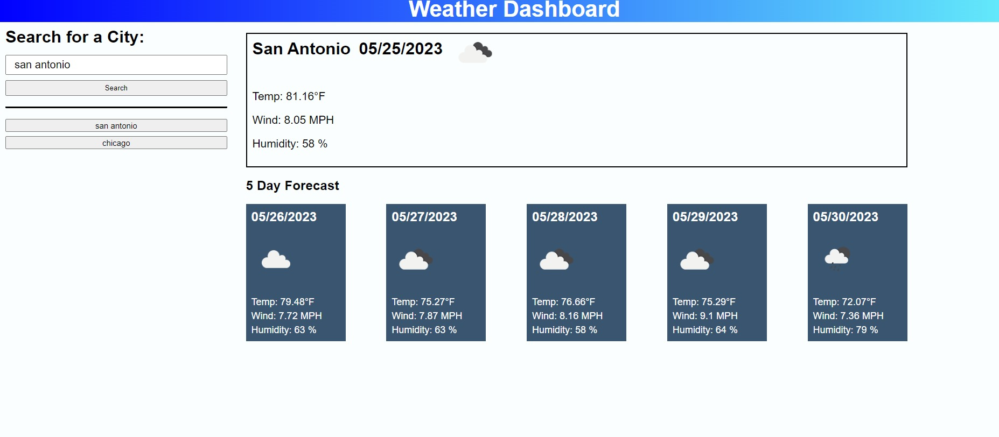

# Weather_Forecast
A website that takes user input to search a server API for a cities coordinates and then returns the current and future weather forecast for 5 days. Previous search results are also stored in local storage.

## Screenshot

## Link to deployed website
[Link to my deployed website](https://jacobdflores.github.io/Weather_Forecast/)

## Helpful resources used

Tutor - cody junior - Gave me some good conceptualization that I was able to use to imagine getting the project done